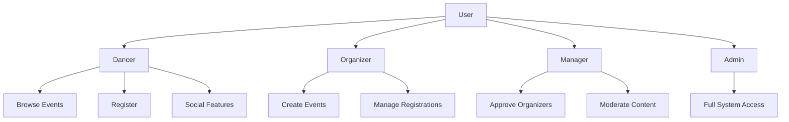

# Project Overview

DANZ is a dance-to-earn cryptocurrency platform that rewards dancers for participating in events, building connections, and contributing to the dance community.

## Core Features

### Event Management

The platform enables users to:
- **Discover Events**: Browse dance events by category, location, skill level
- **Create Events**: Organizers can create and manage dance events
- **Register**: Sign up for events with optional payment processing
- **Check-in**: Verify attendance and earn rewards

### Social Connections

Build meaningful relationships through dance:
- **Dance Bonds**: Form connections with other dancers
- **Bond Levels**: Strengthen bonds through shared sessions (1-100)
- **Social Feed**: Share posts, achievements, and event highlights

### Achievement System

Gamified progression to encourage engagement:
- **XP Points**: Earn experience through activities
- **Levels**: Progress through skill levels
- **Achievements**: Unlock badges and rewards
- **Streaks**: Maintain dance activity streaks

### Subscription Tiers

| Tier | Features | Price |
|------|----------|-------|
| **Free** | Basic access, limited features | $0 |
| **Mover** | Enhanced features, priority registration | $X/mo |
| **Groover** | Premium features, exclusive events | $X/mo |
| **Legend** | Full access, VIP perks | $X/mo |

## User Roles



### Dancer (Default)
- Browse and register for events
- Create social posts
- Build dance bonds
- Earn achievements

### Organizer
- Requires approval
- Create and manage events
- View registrations
- Handle check-ins

### Manager
- Approve organizer requests
- Moderate content
- Access analytics

### Admin
- Full system access
- User management
- System configuration

## Event Categories

| Category | Description |
|----------|-------------|
| `salsa` | Salsa dancing events |
| `hip-hop` | Hip-hop dance |
| `contemporary` | Contemporary/modern dance |
| `ballet` | Classical ballet |
| `jazz` | Jazz dance |
| `ballroom` | Ballroom dancing |
| `street` | Street dance styles |
| `cultural` | Cultural/traditional dance |
| `fitness` | Dance fitness classes |
| `class` | Structured lessons |
| `social` | Social dance gatherings |
| `battle` | Dance competitions |
| `workshop` | Intensive workshops |
| `performance` | Performances/shows |

## Skill Levels

Events and users can be categorized by skill level:

- **All Levels**: Open to everyone
- **Beginner**: New to the style
- **Intermediate**: Comfortable with basics
- **Advanced**: Experienced dancers

## Platform Applications

### danz-web
The main marketing website and user dashboard:
- Landing page with platform information
- User registration and onboarding
- Dashboard for authenticated users
- Profile management
- Event browsing (coming soon)

### danz-miniapp
Lightweight Farcaster miniapp:
- Quick access within Warpcast
- Optimized for 424×695px viewport
- Web3 wallet integration
- Core functionality

### Prototypes
Design exploration with 5 variations:
1. Modern Gradient
2. Neon Cyberpunk
3. Minimalist Clean
4. Retro 80s
5. Enhanced Neon

## Data Model Overview

```
┌─────────────┐     ┌─────────────┐
│    Users    │────▶│   Events    │
└─────────────┘     └─────────────┘
       │                   │
       ▼                   ▼
┌─────────────┐     ┌─────────────┐
│ Achievements│     │Registrations│
└─────────────┘     └─────────────┘
       │
       ▼
┌─────────────┐     ┌─────────────┐
│ Dance Bonds │     │ Feed Posts  │
└─────────────┘     └─────────────┘
       │
       ▼
┌─────────────┐
│Notifications│
└─────────────┘
```

## Next Steps

- [Tech Stack](/guide/tech-stack) - Technologies used
- [Local Setup](/guide/local-setup) - Detailed setup guide
- [Architecture](/architecture/overview) - System design
